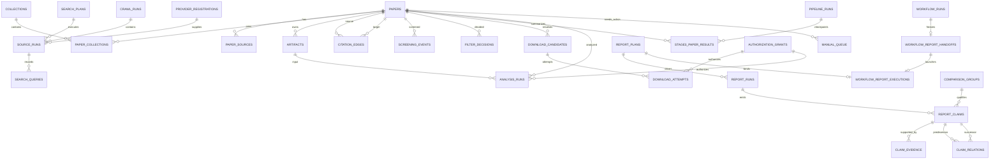

# SQLite ERD 与迁移设计

状态：已实现并由版本化迁移维护。SQLite 是单节点的唯一事实源；JSONL、CSV、旧 JSON/YAML 仅用于导入导出。

## 表与关键约束

| 表 | 不可变/唯一键与关键列 |
|---|---|
| `papers` | `paper_id` 主键；规范书目字段、`verification_status`（`verified/single_source/unverified/conflicted`）与时间戳。显示字段不覆盖来源原始值。 |
| `paper_sources` | `source_id` 主键；`UNIQUE(provider, external_id)`；`paper_id` 外键；URL、版本、license、`access_basis`、来源元数据和 capability 快照。 |
| `collections`, `paper_collections` | collection 与论文多对多；`UNIQUE(paper_id, collection_id)`；`membership_status` 只能是 `official_confirmed/venue_candidate/not_member/conflicted`，官方证据单独保存。 |
| `artifacts` | `artifact_id` 主键；`paper_id` 外键；相对路径、MIME、大小、SHA-256、来源、处理链与状态；不保存 worker 绝对路径。 |
| `crawl_runs`, `source_runs`, `search_queries` | 每次抓取及每次来源调用均有 run/source/query ID、状态、游标、错误、请求/响应 hash、provider/version 与统计。 |
| `search_plans`, `report_plans` | 计划 ID 主键；schema/content hash、不可变计划 JSON、detached approval、状态。批准后的业务字段变化须创建新记录。 |
| `citation_edges` | `UNIQUE(source_paper_id, target_paper_id, edge_type, provider, observed_at)`；方向由 `source_paper_id -> target_paper_id` 固定。 |
| `screening_events`, `filter_decisions` | 绑定 `run_id + paper_id`、输入/配置/模型/prompt/schema hash、理由、最终状态；同一阶段重放不产生第二个完成结果。 |
| `download_candidates`, `download_attempts` | candidate 按 URL/版本独立保存；attempt 引用 candidate、FetchRequest、provider、grant 和分类结果。fetch 只能消费持久化且未过期的请求。 |
| `stage3_paper_results` | migration 19 引入的逐论文聚合 checkpoint；`UNIQUE(run_id, paper_id)`，保存闭集状态、原因和更新时间。`downloaded/not_available/failed_terminal` 为同一冻结 run 的可恢复终态。 |
| `analysis_runs`, `report_runs` | 绑定输入快照/artifact 或 lineage hash、模型 profile、prompt/schema hash、状态和产物路径；报告目录不可变。 |
| `report_claims`, `claim_evidence`, `comparison_groups`, `claim_relations` | claim 使用稳定 UUIDv5；证据引用 paper/run/locator；comparison key 是跨 run 稳定的规范条件；lineage 只允许 `same/refined/split/merged/superseded/retired`。 |
| `provider_registrations` | 绑定 distribution、精确 version、entry point、manifest、内容 digest、审计和信任状态。漂移不更新原记录，而是失效旧注册。 |
| `authorization_grants` | grant 的 canonical content hash、detached approval、撤销事件、时间、action/purpose/scope、artifact/lineage/model/skill digest；YAML defaults 不进入运行时授权。 |
| `download_scope_snapshots` | 下载 collection/selection 的排序 paper IDs、内容哈希和可恢复 snapshot ID；membership 校验从 SQLite 重建并重算哈希。 |
| `workflow_report_handoffs` | migration 24 冻结完成态 Search→Analyze workflow、四个 child run、Stage 3/4 精确论文集合、artifact/output root 及 corpus/audit 文件 hash；完成后不可更新或删除。 |
| `workflow_report_executions` | 每个 handoff 只允许一个 approved ReportPlan 与独立 Report workflow；plan 与 execution 在同一事务先登记，再幂等写不可变 bundle/manifest，冲突请求不会留下未登记文件。 |
| `manual_queue` | 有类型、去重 key、关联 paper/run、原因、状态与人工处理结果；任何不能安全自动完成的条目都入队而非丢弃。 |
| `schema_migrations` | `version` 主键、已应用时间、迁移名称和应用方；只追加。 |

运行数据库在打开连接后设置 `PRAGMA journal_mode=WAL`、`PRAGMA foreign_keys=ON`，以短写事务提交。任务领取使用持久化 lease（`worker_id`、`expires_at`、`attempt`、fencing token）；只有当前 fencing token 可写完成状态。多机 worker 不共享 SQLite，只上传带 epoch 的结果 manifest 给协调端合并。

## 去重、写入与迁移

规范化合并依序匹配 DOI、arXiv ID、同 provider external ID；标题/首作者/年份只产生候选。前三者可幂等合并 source，候选匹配与冲突进入 `manual_queue`。每次合并保留来源字段及 provenance，绝不以规范显示值覆盖原始 source。

迁移是版本化 SQL 文件，按递增版本在单个短事务中执行：先读取 `schema_migrations`，执行未应用 SQL，再插入该版本记录。迁移失败时事务回滚、版本不记录。新增列采用 nullable/backfill/再收紧三步；破坏性形状变化通过新表、复制、校验、切换完成，不原地丢列。启动支持 `--dry-run`，展示当前版本、将执行的迁移和旧 JSON/YAML 的字段映射、警告与无法迁移项。

导入以事务和上述唯一键工作；同一 JSONL/CSV/旧 JSON 导入两次不制造重复。导出从 SQLite 读取，JSONL 保存完整对象，CSV 的嵌套字段显式 JSON 编码。
