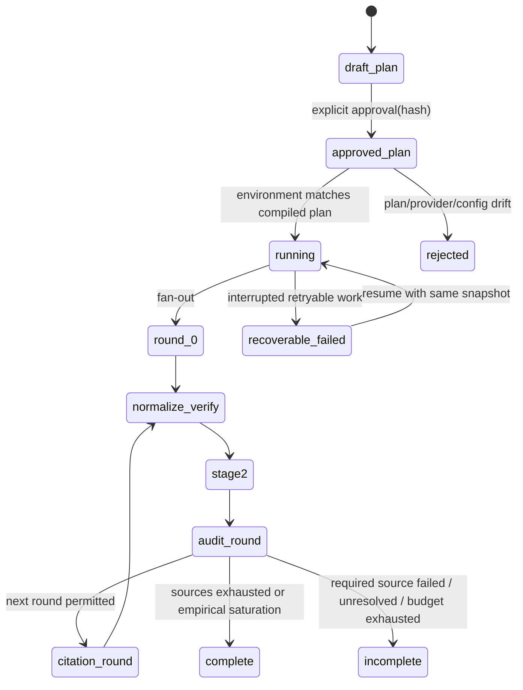
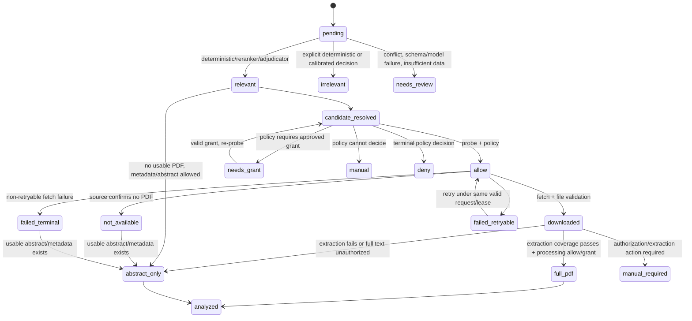
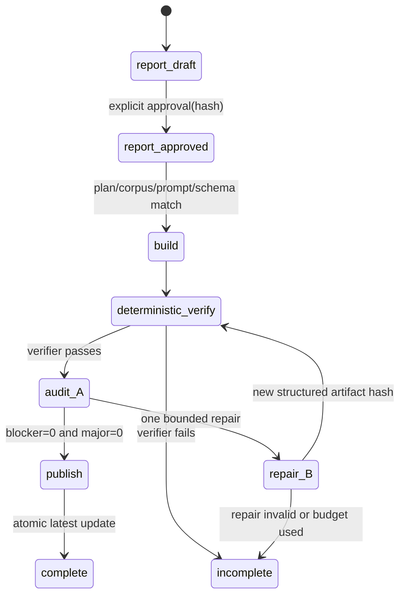

# 状态机与恢复语义

状态：已实现并持续由测试验证。所有转换均写入 run/event 记录；任何未列出的状态转换均拒绝。

## 检索与引用扩展

`complete` 仅在 required providers 成功且没有未完成筛选造成的错误饱和结论时可用。单个 optional source、论文或模型失败不阻塞其他项目；required provider 失败、预算耗尽或 unresolved 会保留产物并标为 `incomplete`。新候选必须回到 Stage 2，不能绕过筛选。

## 筛选、下载与分析

`probe` has no body-download side effect. A `needs_grant` decision never calls fetch. Fetch requires an unexpired, persisted `FetchRequest` matching candidate, policy, purpose, grant and current fencing token. Invalid PDF/HTML error pages never become `downloaded`. Full text sent to Luna requires an artifact-processing allow decision or exact artifact-scoped processing grant; otherwise the only permitted downgrade is separately authorized `abstract_only`, or `analysis_not_authorized/manual_required`.

Stage 3 只有在每篇论文均为 `downloaded`、`not_available` 或 `failed_terminal` 时才把 run 标为 `complete`；这三个终态会在同一冻结实现版本下跳过重复请求。`failed_retryable` 会重试，`auth_required/manual_required` 保持未完成并等待授权或人工处理。无 PDF 的终态只表示下载阶段已确定，不代表已有全文；Stage 4 仍须按实际 abstract/metadata 证据降级。

## 报告发布

Only the coordinator renders `REPORT.md` from `REPORT_DOCUMENT` AST and sidecar bindings. Repair is a typed patch to structured artifacts, never a direct Markdown edit. After repair, a new deterministic verification and an independent fresh Sol audit are mandatory; a second blocker/major leaves the immutable report run `incomplete` and does not update `latest`.

## Recovery and concurrency rules

- Each work item has `pending/running/complete/failed_retryable/failed_terminal/manual_required`-equivalent persisted state plus attempt, lease expiry and fencing token.
- A worker may resume only expired/retryable work from the same frozen snapshot. It cannot change a plan, grant, model revision, prompt/schema or artifact input mid-run.
- Retrying is bounded and recorded. A paper failure never becomes `irrelevant`, `downloaded` or `analyzed` by default；只有协调层确认每篇论文都达到不可变终态后，Stage 3 run 才可标为 `complete`。
- Same run/stage/paper/output kind plus the same content hash is idempotent. The same key with a different hash is a conflict/manual item, not last-write-wins.
- Coordinator-only merge accepts current shard epoch; late epochs are rejected. Coverage checks identify exactly which papers/artifacts to reissue.
